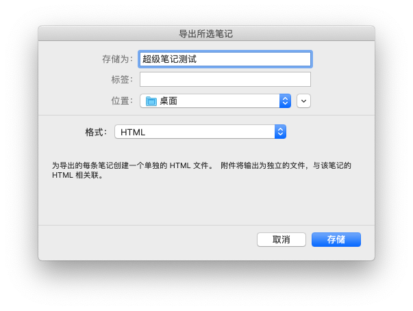
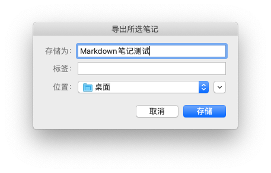

# 安装

在安装本插件前，请确认您已经安装 Anki 2.1.x。

## 自动安装

在 Anki 的 `Tools` - `Add-ons` 界面点击 `Get Addons ...` 并输入 ID 831016260 安装。

## 手动安装

在 [GitHub 发布页面](https://github.com/tansongchen/AnkiEvernoteImporter/releases) 下载压缩文件 `EvernoteImporter.ankiaddon`，双击安装。

# 原理

在印象笔记中，无论是超级笔记还是 Markdown 笔记，都可以通过各级标题（超级笔记支持一至三级标题，Markdown 笔记支持一至六级标题）的使用来形成结构化的笔记文档。本插件利用了这一特性，将特定级别的标题识别为 Anki 卡片的正面，而把该标题下的内容识别为 Anki 卡片的背面。

更加严谨地说，若在导入界面设置标题层级为 N，则每个 N 级标题都会成为一张 Anki 卡片的正面，这张卡片对应的背面内容是笔记文档中「从该标题开始（不含），到下一个层级小于或等于 N 的标题为止（不含）」。例如，给定 Markdown 文档

```markdown
# 一级标题

## 二级标题 1

内容 1

### 三级标题

## 二级标题 2

内容 2
```

则将生成两张卡片：

- 第一张卡片正面为「二级标题 1」，背面为「内容 1」和「三级标题」
- 第二张卡片正面为「二级标题 2」，背面为「内容 2」

# 使用（超级笔记）

## 制作超级笔记

在印象笔记中新建超级笔记：


## 从印象笔记导出

在印象笔记中点击 `文件` - `导出笔记`，将笔记导出为 HTML 格式：



## 从 Anki 导入

在 Anki 的 `Tools` 界面点击 `从印象笔记导入……`，并根据界面指示操作。

# 使用（Markdown 笔记）

## 制作 Markdown 笔记

在印象笔记中新建 Markdown 笔记：


## 从印象笔记导出

在印象笔记中右键点击 Markdown 笔记的预览区，将笔记导出为 Markdown 格式：



## 从 Anki 导入

在 Anki 的 `Tools` 界面点击 `从印象笔记导入……`，并根据界面指示操作。

# 特性

## 导入印象笔记中的超级笔记

- 支持行内元素：加粗、斜体、下划线、颜色、高亮、字体字号
- 支持块元素：有序和无序列表、表格、分割线、代码块
- 支持图片（和笔记同时导出）

## 导入印象笔记中的 Markdown 笔记

- 支持行内元素：加粗、斜体、下划线、删除线、超链接、行内代码和公式
- 支持块元素：有序和无序列表、标题、引用、分割线、图片、代码块和公式块

# 关于印象笔记中的普通笔记

由于普通笔记没有标题功能，不适合进行结构化笔记的记录，也无法有效划分各个 Anki 卡片的字段，因此不再维护。您仍然可以导入普通笔记，但请不要过于依赖此功能。

